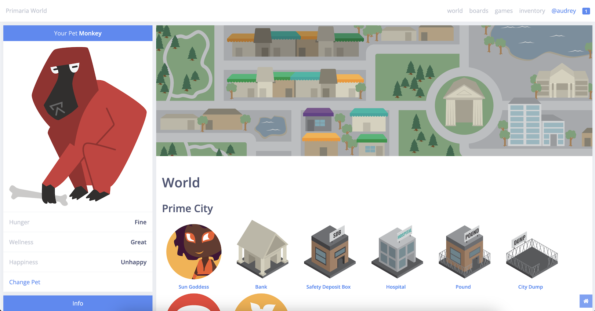
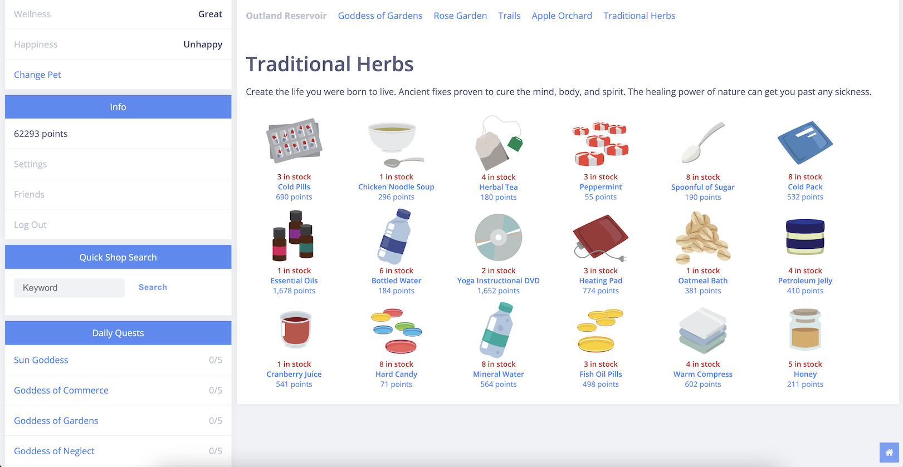

# Primaria World
### Primaria World is a virtual pet site that began in September 2017. You can adopt and raise a pet of your own, without any of the cleanup or expensive care products. There are many species, colors, and patterns to discover, and many more features to play with, so join today to try it all out!

## Screenshots

### World Page


### Shop Page


## Features
- Choose from 10 adorable creatures in many different colors
- Take care of your pets' hunger, wellness, and happiness
- Collect all the items: plushies, books, trading cards, and more
- Complete quests for the Gods & Goddesses of the world
- Play games and earn points
- Be social on the boards, messages, and trades

## Roadmap
- [ ] Instant messaging
- [ ] New and improved world map
- [ ] Online trading card game

## Local Installation

The instructions focus on M1 MacOS. You may have to modify instructions for other platforms.

### Requirements
- Python 3.9
- Postgres
- Pip
- `rabbitmq`

### Create Python2 Env
- `python -m virtualenv env`

### Create Database
- Create `primaria` database in Postgres

### Add Database Secrets to Env
- Add variables to `env/bin/activate`:
```bash
export SECRET_KEY='your_secret_key_here' # you can generate one
export DB_NAME='your_database_name_here'
export DB_USER='your_database_username_here'
export DB_PASS='your_database_password_here'
export DB_HOST='your_database_hostname_here' # e.g. localhost
```

#### Start Env
- `source env/bin/activate`

### Install Dependencies
- `pip install -r requirements.txt`

### Migrate Database
- `python manage.py migrate`

### Load DB Data
- `python manage.py loaddata db.json`

### Start Workers
- `brew services start rabbitmq`
- `celery -A primaria worker -l INFO`
- `celery -A primaria beat`

### Start Server
- `python manage.py createsuperuser` (optional)
- `python manage.py runserver`

